# SDN Path Tracing Tool
**Course:** UE24CS252B - Computer Networks
**University:** PES University

## Problem Statement
Implement an SDN-based path tracing tool that identifies
and displays the path taken by packets through the network
using OpenFlow flow rules installed by Ryu controller.

## Objectives
- Track flow rules on each switch
- Identify forwarding path hop by hop
- Display route taken by packets
- Validate using ping and iperf tests

## Topology

h1 ─┐
     ├── S1 ─── S2 ─── h3
h2 ─┘         │
              └── h4

IPs:
h1 → 10.0.0.1  
h2 → 10.0.0.2  
h3 → 10.0.0.3  
h4 → 10.0.0.4  

2 switches, 4 hosts, controlled by Ryu controller

## Requirements
- Ubuntu 20.04/22.04
- Mininet 2.3.0
- Ryu SDN Controller
- Open vSwitch
- Python 3

## Installation & Setup

### Install Mininet
```bash
sudo apt update
sudo apt install mininet -y
pip3 install ryu
```

### Clone this repo
```bash
git clone https://github.com/YOURUSERNAME/sdn_path_tracer.git
cd sdn_path_tracer
```

## Execution Steps

### Step 1 - Start Ryu Controller (Terminal 1)
```bash
ryu-manager path_tracer_controller.py --ofp-tcp-listen-port 6633 --verbose
```

### Step 2 - Start Mininet Topology (Terminal 2)
```bash
sudo python3 path_tracer_topo.py
```

### Step 3 - Run Tests (Terminal 2)
```bash
mininet> pingall
mininet> h1 ping -c 4 h3
mininet> h3 iperf -s &
mininet> h1 iperf -c 10.0.0.3 -t 5
```

### Step 4 - View Path Trace (Terminal 3)
```bash
python3 show_path.py
python3 show_path.py 10.0.0.1 10.0.0.3
```

## Test Scenarios

### Scenario 1 - Basic Connectivity
mininet> pingall
*** Results: 0% dropped (12/12 received)
All 4 hosts successfully communicate through SDN switches.

### Scenario 2 - Path Trace h1 to h3
mininet> h1 ping -c 4 h3
4 packets transmitted, 4 received, 0% packet loss
Packet travels: h1 → S1 (port 1→3) → S2 (port 1→2) → h3

## Expected Output

### Flow Tables (ovs-ofctl dump-flows)
priority=10,ip,in_port=s1-eth1,nw_src=10.0.0.1,nw_dst=10.0.0.3
actions=output:s1-eth3

### Path Trace Output
PATH TRACE: 10.0.0.1 → 10.0.0.3
Hop 1: Switch dpid=1 | in=1 out=3 | ICMP
Hop 2: Switch dpid=2 | in=1 out=2 | ICMP

## Performance Results
| Test | Result |
|------|--------|
| TCP Throughput (iperf) | 9.58 Mbits/sec |
| UDP Throughput (iperf) | 1.05 Mbits/sec |
| UDP Packet Loss | 0% |
| Ping Latency (avg) | ~0.3 ms |
| Packet Loss (pingall) | 0% |

## Proof of Execution Screenshots

### 1. Ryu Controller Started
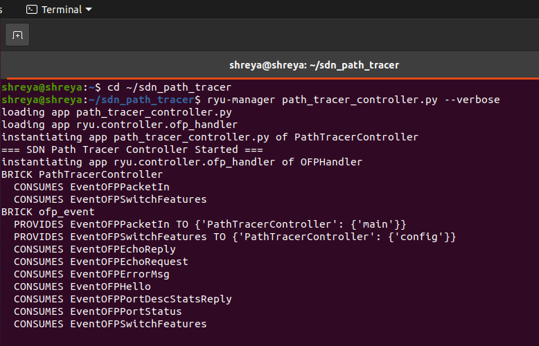

### 2. Mininet Topology
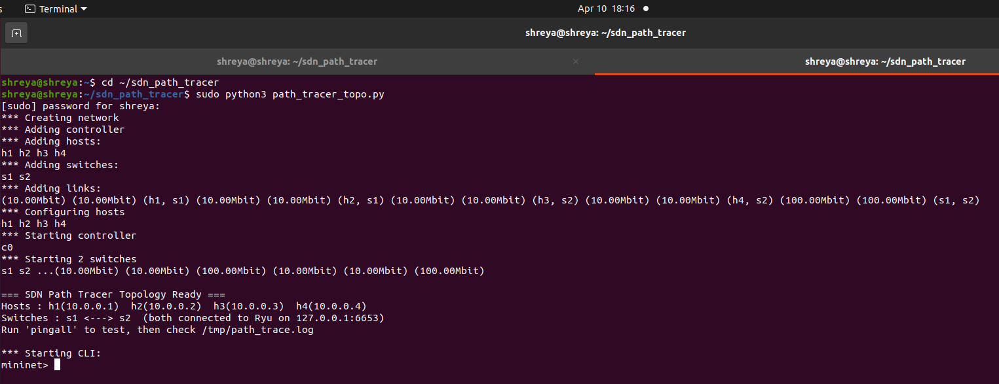

### 3. pingall - 0% dropped
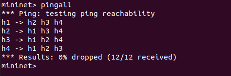

### 4. iperf TCP Result
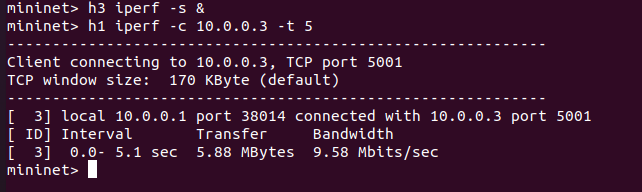

### 5. Flow Tables with Packet Counts
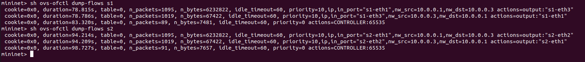

### 6. iperf UDP Result
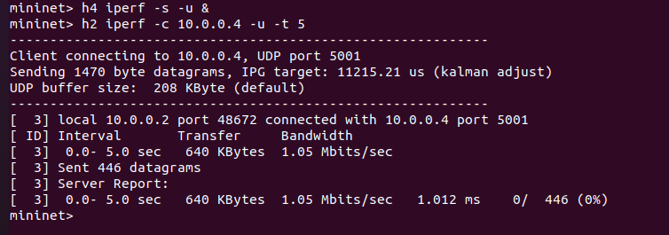

### 7. Path Trace - All Flows
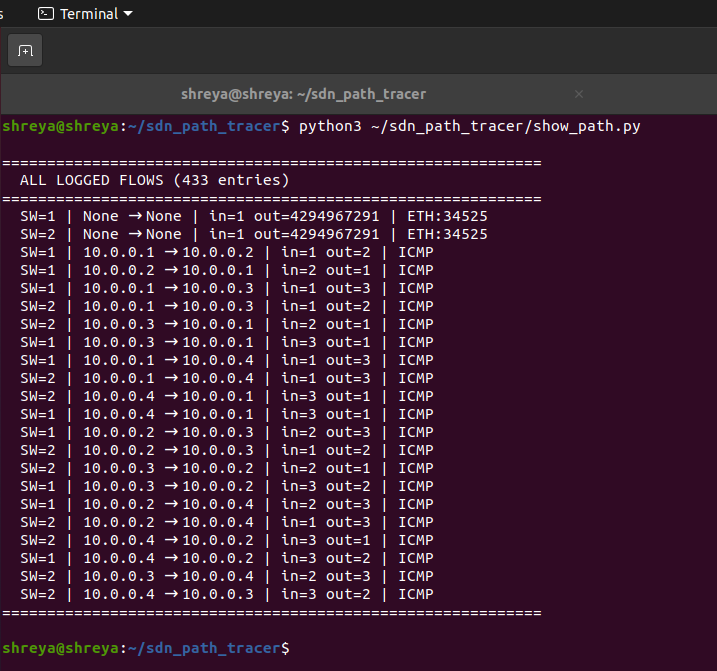

### 8. Live JSON Log
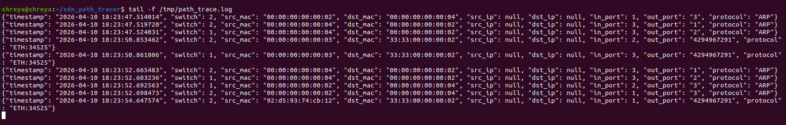

### 9. Validation Pings
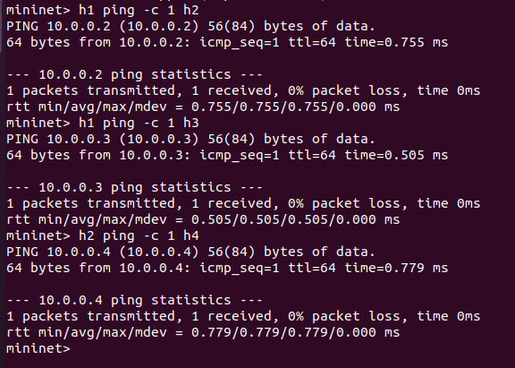

### 10. Wireshark Capture
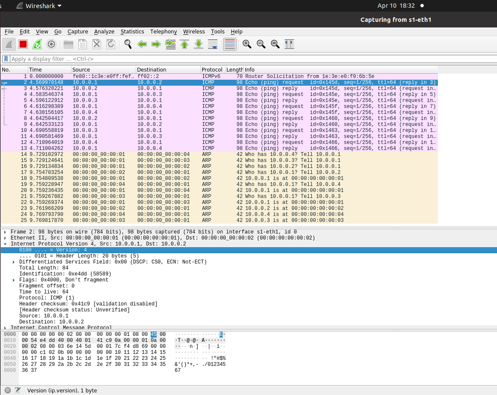

### 11. Wireshark ICMP Filter
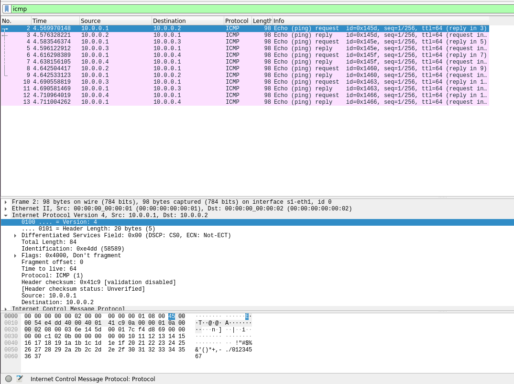

### 12. Wireshark h1→h3 Filter
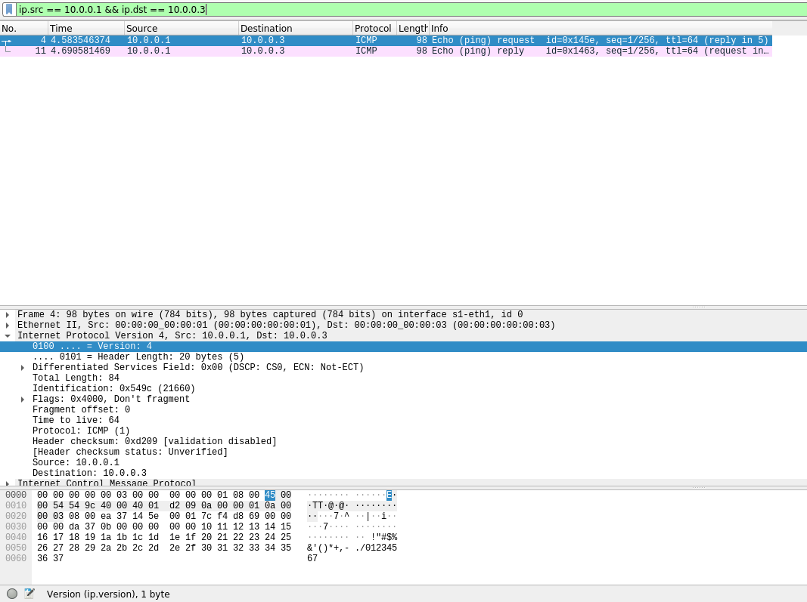

### 13. show_path.py h1→h3
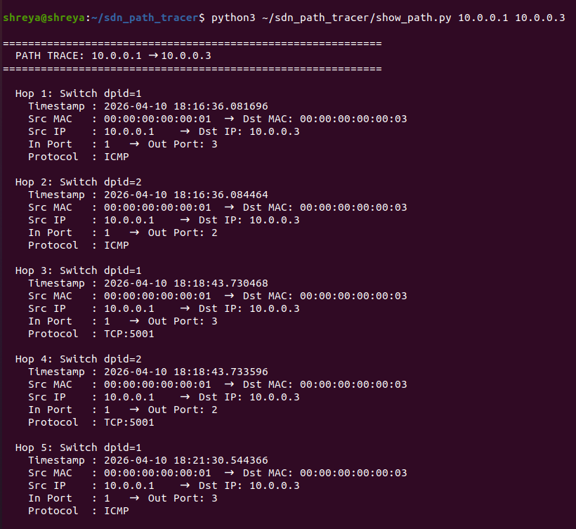
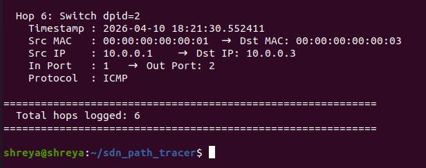

### 14. Clean Exit
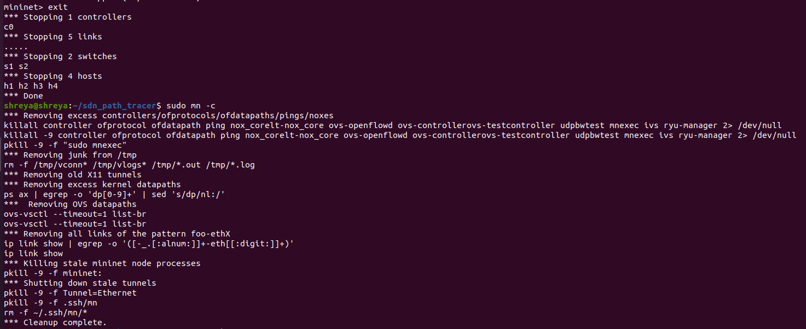
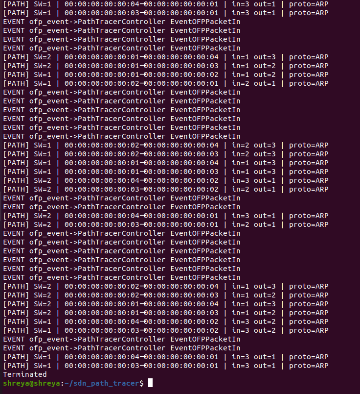

## SDN Concepts Demonstrated
- **Controller-Switch Interaction:** Ryu handles packet_in events
- **Flow Rule Design:** match+action rules per flow
- **Dynamic Flow Management:** idle_timeout=60s auto-removal
- **Path Tracing:** hop-by-hop logging through switches
- **Performance Monitoring:** iperf + ping metrics

## References
1. Mininet - https://mininet.org/overview/
2. Ryu SDN Framework - https://ryu-sdn.org
3. OpenFlow Specification - https://opennetworking.org
4. Mininet Walkthrough - https://mininet.org/walkthrough/
